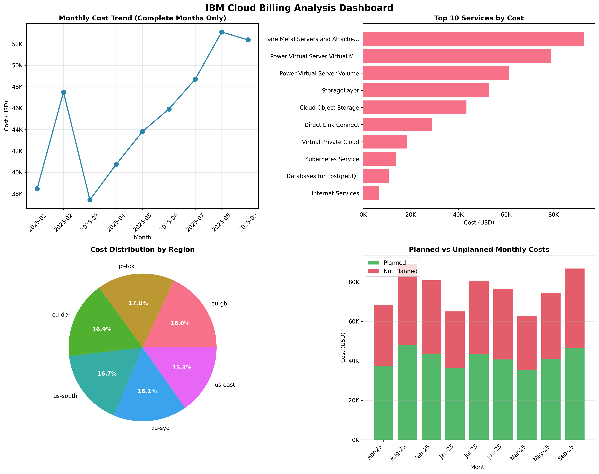
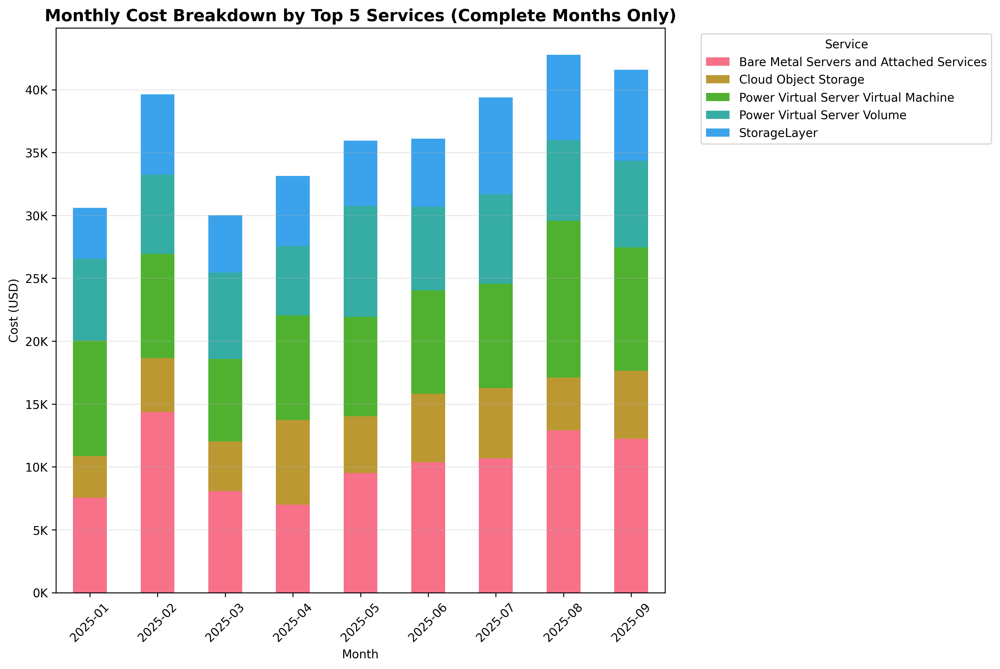
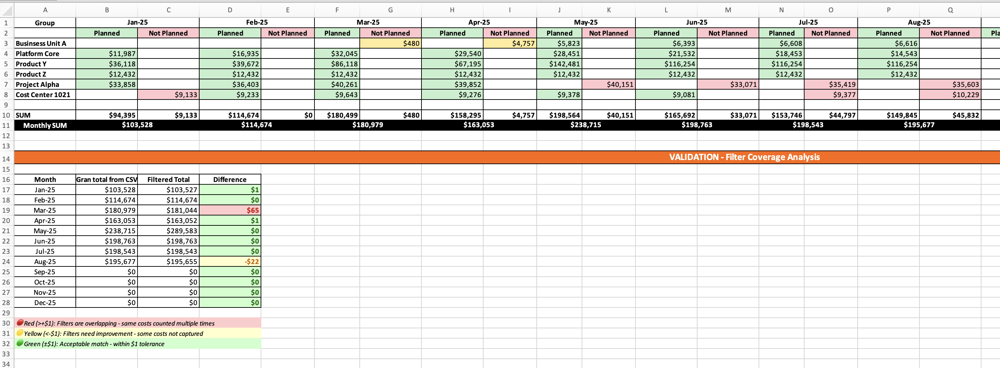

# IBM Spend Sleuth

[](https://opensource.org/licenses/MIT)
[](https://www.python.org/downloads/)

Python toolkit for analyzing IBM Cloud billing data. Provides pattern-based filtering, YAML budget planning, Excel reporting, and cost analysis for organizations without retroactive resource tagging.

## Features

- Currency conversion to USD using CSV exchange rates
- Multi-filter system with AND/OR/EXCLUDE logic
- YAML-based budget planning with variance analysis
- Uncategorized cost detection and coverage tracking
- Pattern matching across any CSV column (Instance Name, Plan Name, Consumer ID, etc.)
- Excel exports with completeness analysis
- Month-specific and time-range filtering
- **Partial month detection** - automatically identifies incomplete billing months
- CLI, interactive, and programmatic interfaces
- Visualization charts with partial month indicators

## Why This Tool

IBM Cloud doesn't support retroactive resource tagging. This toolkit enables cost allocation for infrastructure with inconsistent naming conventions using flexible pattern-based filtering instead of tags.

## Setup

**Prerequisites**: Python 3.8+, pip

```bash
# Clone and install
git clone https://github.com/vechiato/ibm-spend-sleuth.git
cd ibm-spend-sleuth
python -m venv .venv
source .venv/bin/activate  # Windows: .venv\Scripts\activate
pip install -r requirements.txt

# Add CSV files to data/billing/

# Setup planning config
cp config/filters.yaml.example config/filters.yaml
# Edit config/filters.yaml for your infrastructure
```

## Quick Start

```bash
# Quick analysis
python src/quick_analyzer.py

# Filter specific patterns
python src/filter_billing.py --pattern "*your-pattern*"

# Multi-filter with column search
python src/filter_billing.py --service "Bare Metal" --pattern-column "Plan Name" --pattern "*Ghz*" --months 2025-04

# Generate Excel planning report
python src/generate_planning_excel.py --yaml config/filters.yaml --output planning_report.xlsx

# Create visualizations
python src/visualize_billing.py
```

## Sample Visualizations

The following dashboards demonstrate the tool's capabilities using synthetic data:

### Dashboard Overview (4-panel analysis)



The dashboard provides:
- **Monthly Cost Trend**: Track spending patterns over time (partial months excluded)
- **Top 10 Services**: Identify highest cost drivers
- **Regional Distribution**: Understand geographic cost allocation
- **Service Group Breakdown**: Monthly stacked area chart showing cost evolution by service

### Monthly Service Breakdown



Stacked bar chart showing month-over-month cost distribution across top 5 services.

**Note**: These visualizations use completely synthetic data generated with `scripts/generate_sample_data.py`. No real customer information is included.

### Generate Your Own Sample Images

```bash
# Create fake billing data (9 months)
python scripts/generate_sample_data.py

# Generate visualization images
python scripts/generate_sample_visualizations.py

# Images saved to examples/ directory
```

See `scripts/README.md` for more details on sample data generation.

## Multi-Filter YAML Configuration

Combine multiple filter criteria per cost group with OR logic:
```yaml
groups:
  - name: Bare Metal Infrastructure
    months:
      May-25: 50000    # Budget amount or 'planned'/'not_planned'
      Jun-25: planned
    filters:           # Multiple filters combined with OR logic
      - python src/filter_billing.py --instances "bm-prod*, bm-dr*"
      - python src/filter_billing.py --service "*Bare Metal*" --pattern-column "Plan Name" --pattern "*Ghz*"
      - python src/filter_billing.py --pattern "*storage*" --pattern-column "Resource"
```

## 📊 Project Structure

```
ibm-spend-sleuth/
├── README.md              # This file
├── LICENSE               # MIT license
├── requirements.txt      # Python dependencies
├── setup.py             # Package installation
├── MANIFEST.in          # Package manifest
├── 
├── src/                 # Core source code
│   ├── __init__.py
│   ├── ibm_billing_parser.py      # Main parser and analysis engine
│   ├── filter_billing.py          # Interactive and command-line filtering
│   ├── generate_planning_excel.py # YAML-to-Excel planning generator
│   ├── quick_analyzer.py          # Fast daily monitoring and alerts
│   ├── visualize_billing.py       # Chart generation and visualization
│   └── service_examples.py        # Service-specific filtering examples
├── 
├── config/              # Configuration templates
│   ├── README.md        # Configuration guide
│   └── filters.yaml.example      # Template for YAML planning (copy to config/filters.yaml)
├── 
├── data/                # Your local data (gitignored)
│   ├── README.md        # Data directory guide
│   ├── billing/         # Place your CSV files here
│   └── outputs/         # Generated reports and analysis
├── 
├── examples/            # Usage examples and demonstrations
│   ├── basic_analysis.py
│   ├── basic_usage.py
│   ├── planning_workflow.py
│   ├── and_or_logic_examples.py
│   ├── sample_ibm_billing_dashboard.png         # Sample dashboard (fake data)
│   └── sample_monthly_service_breakdown.png     # Sample breakdown (fake data)
├── 
├── scripts/             # Utility scripts
│   ├── generate_sample_data.py           # Generate fake billing data
│   ├── generate_sample_visualizations.py # Create sample charts
│   └── README.md        # Scripts documentation
├── 
├── tests/               # Unit tests
│   ├── __init__.py
│   ├── test_basic.py
│   └── test_partial_month_detection.py
├── 
└── docs/                # Documentation
    ├── CONTRIBUTING.md
    └── CHANGELOG.md
```

## Core Tools

- **`ibm_billing_parser.py`** - Main parser and analysis engine
- **`filter_billing.py`** - CLI/interactive filtering
- **`generate_planning_excel.py`** - YAML-to-Excel planning reports
- **`quick_analyzer.py`** - Fast daily monitoring
- **`visualize_billing.py`** - Chart generation

## Usage Examples

### Basic Filtering
```bash
# By instance
python src/filter_billing.py --instances "ORACLE-PROD001,ORACLE-PROD002"
python src/filter_billing.py --pattern "*oracle*"
python src/filter_billing.py --instances "*-PROD0*,*-DEV0*"

# By service
python src/filter_billing.py --services "Power Virtual Server Virtual Machine"
python src/filter_billing.py --services "*Power Virtual Server*"

# By region/time
python src/filter_billing.py --regions "fra02,eu-de-2"
python src/filter_billing.py --months "2025-07,2025-08"

# Combined filters
python src/filter_billing.py --instances "*oracle*" --services "Power Virtual Server Virtual Machine"

# Exclude mode (inverse filter)
python src/filter_billing.py --instances "*oracle*" --exclude
python src/filter_billing.py --instances "*PROD*" --services "*Virtual Machine*" --exclude

# Export and interactive
python src/filter_billing.py --instances "*ORACLE*" --months "2025-07,2025-08" --export
python src/filter_billing.py --interactive
```

### Analysis Commands

```bash
# Quick overview
python src/quick_analyzer.py quick

# Full analysis
python src/quick_analyzer.py full
python src/ibm_billing_parser.py

# Export to CSV
python src/quick_analyzer.py export

# Generate charts
python src/visualize_billing.py
```

## Filtering Capabilities

- Multiple filters per group with OR logic
- Pattern matching on any CSV column (Instance Name, Plan Name, Consumer ID, Resource, etc.)
- Time-based filtering (--months parameter)
- Exclude mode (inverse filtering with --exclude)
- Month validation with early warnings
- **Partial month detection** - identifies incomplete billing data automatically
- AND/OR logic operators (--logic and|or)
- Wildcard support for pattern matching
- Uncategorized cost detection

## Advanced Usage

### AND/OR Logic
```bash
# AND - Oracle instances that are VMs
python src/filter_billing.py --instances "*ORACLE*" --services "*Virtual*" --logic and

# OR - Oracle instances OR Storage services
python src/filter_billing.py --instances "*ORA*" --services "*Storage*" --logic or
```

### Pattern-Column Filtering
```bash
# Search Plan Name column
python src/filter_billing.py --pattern "*gateway*" --pattern-column "Plan Name"

# Search Consumer ID
python src/filter_billing.py --pattern "*pvm-instance*" --pattern-column "Consumer ID"
```

### Exclude Mode
```bash
# Everything EXCEPT Oracle
python src/filter_billing.py --instances "*oracle*" --exclude

# Exclude production VMs
python src/filter_billing.py --instances "*PROD*" --services "*Virtual Machine*" --exclude

# Exclude with OR logic
python src/filter_billing.py --instances "*oracle*" --services "*Storage*" --logic or --exclude
```

### Month Validation
Automatic validation with warnings for missing months:
```bash
python src/filter_billing.py --instances "*prod*" --months "2025-10,2025-11"
# Warns if months don't exist, shows available months, exits or proceeds with valid subset
```

## YAML Planning Configuration

Generate Excel reports mapping billing data to budget categories.



### Setup
```bash
cp config/filters.yaml.example config/filters.yaml
# Edit config/filters.yaml
```

### YAML Structure

```yaml
groups:
  - name: VMWARE Infrastructure
    months:
      May-25: 50000    # Budget amount
      Jun-25: planned  # Unlimited
    filters:           # Multiple filters with OR logic
      - python src/filter_billing.py --instances "vmware-prod*, vmware-dr*"
      - python src/filter_billing.py --service "Bare Metal*" --pattern "*Ghz*" --pattern-column "Plan Name"

  - name: Production Servers
    months:
      Jan-25: planned
      Feb-25: planned
    filter: python src/filter_billing.py --instances "*-PROD-*"
```

### Budget Specification

Months can have numeric budgets or keywords:
- **Numeric** (e.g., `41200`): Budget amount in USD
- **`planned`**: Unlimited budget
- **`not_planned`**: Zero budget
- **Omitted**: Defaults to zero

### Budget Logic
- Actual ≤ Budget: All cost is planned
- Actual > Budget: Budget amount is planned, excess is not planned
- No budget: All cost is not planned

### Multi-Period Budgets

Supported period formats:
- **Monthly**: `Jan-25`, `Feb-25`, etc.
- **Quarterly**: `Q1-25`, `Q2-25`, `Q3-25`, `Q4-25`
- **Half-Yearly**: `H1-25`, `H2-25`
- **Annual**: `Annual-25` or `Year-25`

```yaml
groups:
  - name: Network Infrastructure
    months:
      Q1-25: 180000     # $60K/month for Jan-Mar
      H2-25: 360000     # $60K/month for Jul-Dec
      Annual-25: 720000 # $60K/month for all months
    filter: python src/filter_billing.py --services "Network*"
```

### Generate Report
```bash
python src/generate_planning_excel.py --yaml config/filters.yaml --output planning_report.xlsx
```

### Excel Output
- **Planning Grid**: Planned vs not planned costs per month
- **Budget Variance**: Budget vs actual with over/under indicators (green/red/yellow)
- **Data Completeness**: Coverage % and uncategorized cost breakdown (orange warnings)
- **Summary Analysis**: Total cost aggregations

Test filters before adding to YAML:
```bash
python src/filter_billing.py --instances "*YOUR-PATTERN*" --services "*SERVICE*"
# Copy working command to YAML config
```

## CSV File Format

IBM Cloud billing CSV structure:
- Line 1: Header metadata (Account Owner ID, Account Name, Billing Month, Created Time, etc.)
- Line 2: Account values
- Line 3: Empty
- Line 4+: Billing data (Service Name, Instance Name, Cost, etc.)

### Partial Month Detection

The tool automatically detects partial (incomplete) months by comparing the billing month with the CSV creation date:

- **Complete Month**: CSV created after the billing month ends
  - Example: Billing Month "2025-09", Created Time "2025-10-06" → Complete ✓
- **Partial Month**: CSV created within the billing month
  - Example: Billing Month "2025-10", Created Time "2025-10-16" → Partial ⚠️

Partial months are marked with:
- Warning message during data load
- "⚠️ (Partial)" indicator in monthly cost lists
- Dashed orange line in trend charts
- Orange border in monthly breakdown charts

## Programmatic Usage

```python
from ibm_billing_parser import IBMBillingParser

parser = IBMBillingParser("data/billing")
data = parser.load_all_data()

# Custom analysis
custom_analysis = data.groupby('Plan Name')['Cost'].sum()

# Filter data
storage_costs = data[data['Service Name'].str.contains('Storage')]
recent_data = data[data['Billing Month'] >= '2025-06']
eu_costs = data[data['Region'].str.contains('eu')]
```

## Troubleshooting

- **No CSV files found**: Add billing CSVs to `data/billing/`
- **Import errors**: `pip install -r requirements.txt`
- **Empty data**: Verify CSV follows IBM billing format
- **Permission errors**: Check file read permissions

## License

MIT License - see [LICENSE](LICENSE) file